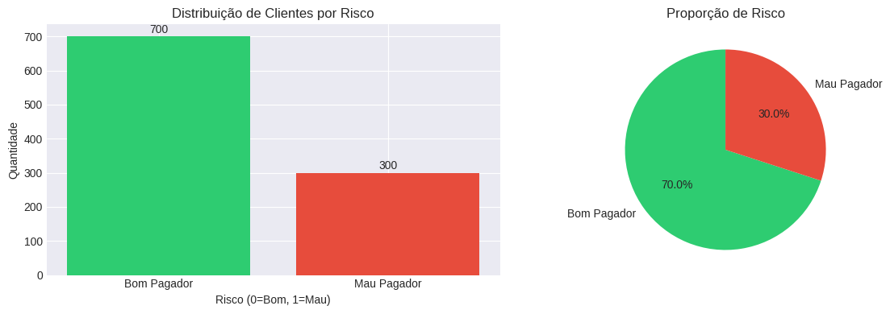
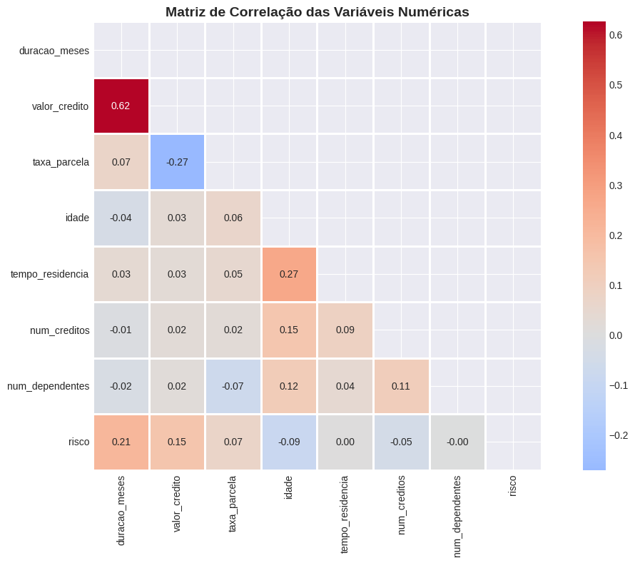
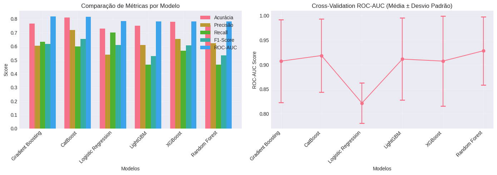
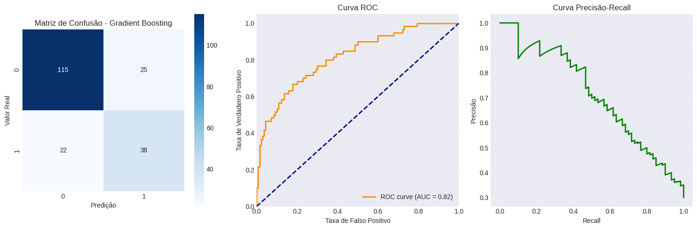
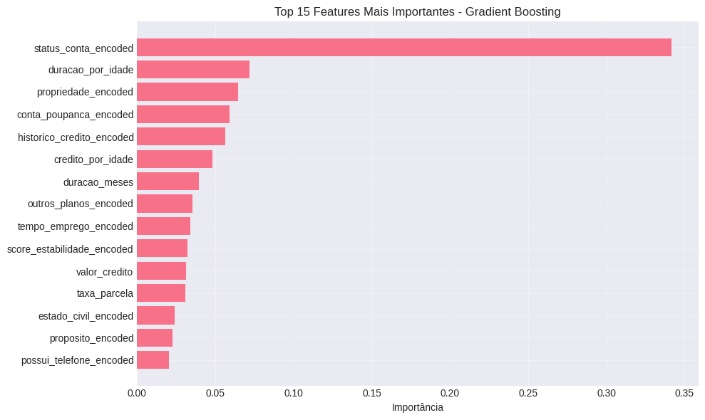
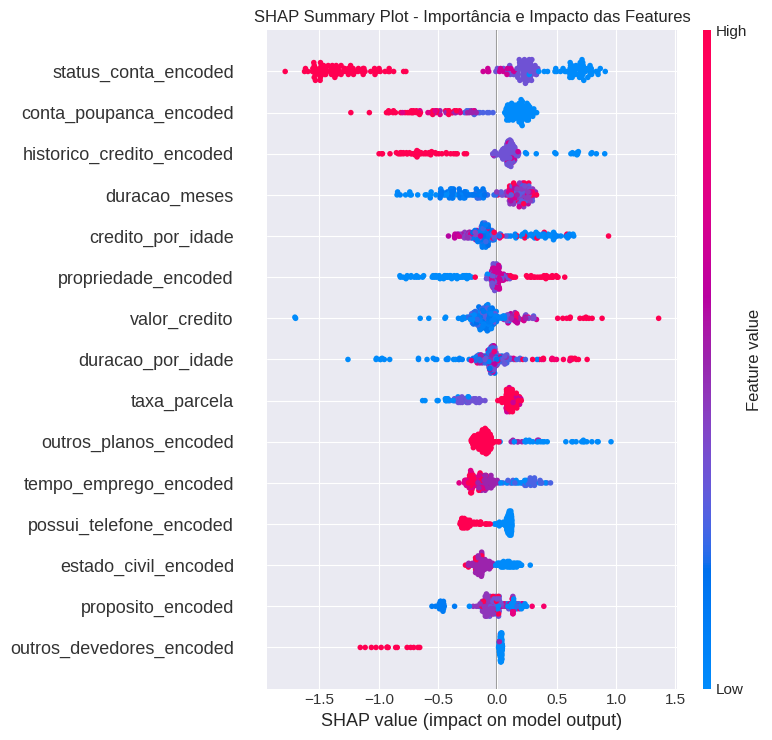
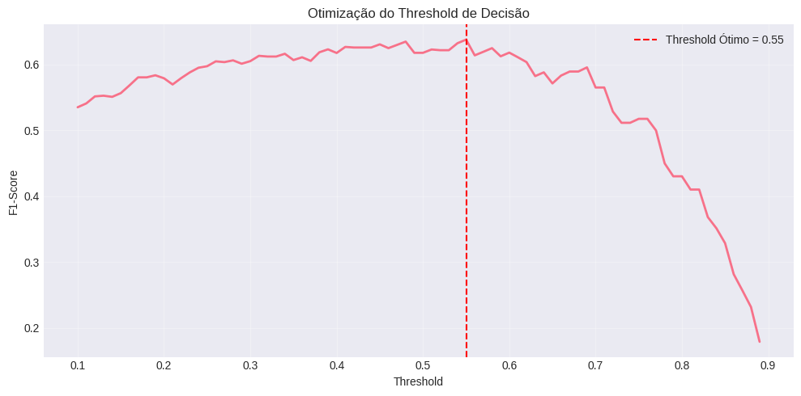
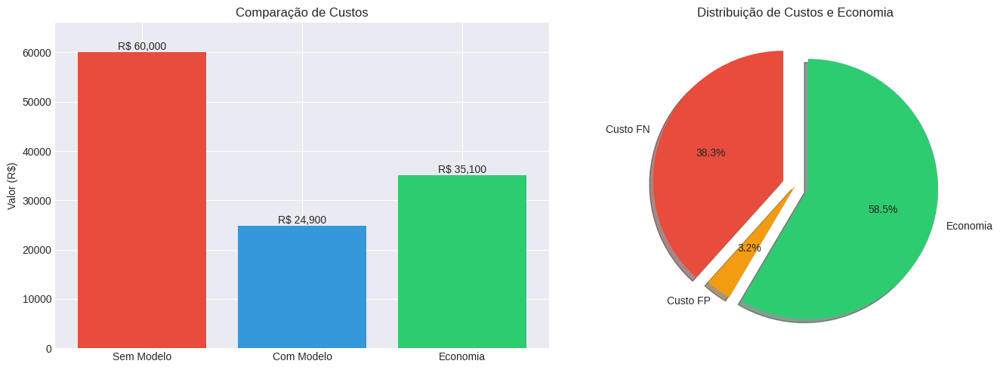
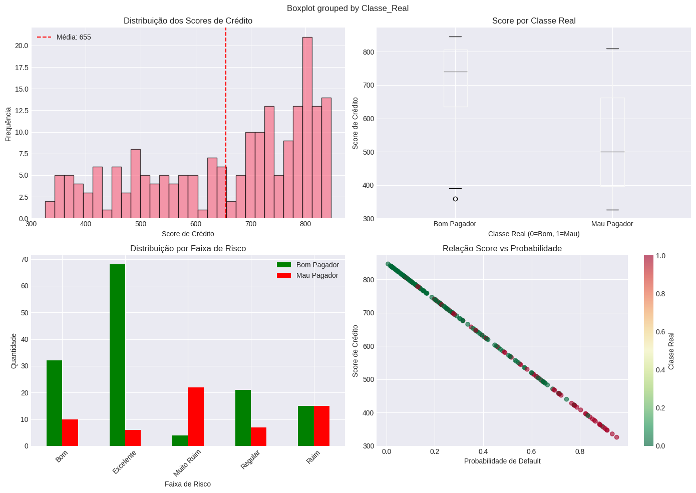

# Análise e Modelagem de Risco de Crédito

Este projeto visa desenvolver um modelo de machine learning para prever o risco de inadimplência de clientes, otimizando a concessão de crédito e minimizando perdas financeiras.

## 1. Análise e Preparação dos Dados

Este projeto utiliza uma versão do dataset "German Credit Data", um conhecido benchmark público para problemas de classificação de risco de crédito. O objetivo é construir um modelo preditivo robusto a partir das características demográficas e financeiras dos clientes.

O processo iniciou-se com a importação das bibliotecas e o carregamento do conjunto de dados.

-   ✅ Bibliotecas importadas com sucesso!
-   📊 Versão do Pandas: 2.2.2
-   📊 Dataset carregado com sucesso!
-   **Shape do dataset:** (1000, 21)
-   **Memória utilizada:** 0.16 MB

### 1.1. Visualização Inicial

As primeiras linhas do dataset:

| status\_conta | duracao\_meses | historico\_credito | proposito | valor\_credito | conta\_poupanca | tempo\_emprego | taxa\_parcela | estado\_civil | outros\_devedores | tempo\_residenci a | propriedade | idade | outros\_planos | tipo\_residencia | num\_creditos | tipo\_emprego | num\_dependentes | possui\_telefone | trabalhador\_estrangeiro | risco |
| :--- | :--- | :--- | :--- | :--- | :--- | :--- | :--- | :--- | :--- | :--- | :--- | :--- | :--- | :--- | :--- | :--- | :--- | :--- | :--- | :--- |
| A11 | 6 | A34 | A43 | 1169 | A65 | A75 | 4 | A93 | A101 | 4 | A121 | 67 | A143 | A152 | 2 | A173 | 1 | A192 | A201 | 0 |
| A12 | 48 | A32 | A43 | 5951 | A61 | A73 | 2 | A92 | A101 | 2 | A121 | 22 | A143 | A152 | 1 | A173 | 1 | A191 | A201 | 1 |
| A14 | 12 | A34 | A46 | 2096 | A61 | A74 | 2 | A93 | A101 | 3 | A121 | 49 | A143 | A152 | 1 | A172 | 2 | A191 | A201 | 0 |
| A11 | 42 | A32 | A42 | 7882 | A61 | A74 | 2 | A93 | A103 | 4 | A122 | 45 | A143 | A153 | 1 | A173 | 2 | A191 | A201 | 0 |
| A11 | 24 | A33 | A40 | 4870 | A61 | A73 | 3 | A93 | A101 | 4 | A124 | 53 | A143 | A153 | 2 | A173 | 2 | A191 | A201 | 1 |

### 1.2. Informações Estatísticas e Tipos de Dados

-   ✅ Não há valores ausentes no dataset!

### 1.3. Análise Exploratória (EDA)

A distribuição da variável alvo (`risco`) mostra um desbalanceamento de 70% de bons pagadores (classe 0) e 30% de maus pagadores (classe 1).

A análise das distribuições e correlações revelou que variáveis como `duracao_meses` e `valor_credito` possuem correlação positiva com o risco.

## 2. Pré-processamento e Feature Engineering

-   ✅ **Feature Engineering concluído!**
-   ✅ **Encoding concluído!**
-   🔄 **Divisão dos dados:** Treino (800 amostras) e Teste (200 amostras), com estratificação para manter a proporção das classes.
-   ✅ **Dados normalizados com RobustScaler.**
-   ⚖️ **Balanceamento com SMOTE:** Aplicado apenas nos dados de treino para evitar vazamento de dados (data leakage).

## 3. Modelagem e Treinamento

Foram treinados e avaliados seis algoritmos de classificação para identificar o de melhor performance.

### 3.1. Comparação e Seleção do Modelo

O **Gradient Boosting** se destacou como o modelo com o maior ROC-AUC, indicando a melhor capacidade de discriminação entre as classes.

| Modelo | Acurácia | Precisão | Recall | F1-Score | ROC-AUC | CV-Mean | CV-Std |
| :--- | :--- | :--- | :--- | :--- | :--- | :--- | :--- |
| **Gradient Boosting** | **0.7650** | **0.6032** | **0.6333** | **0.6179** | **0.8181** | **0.9073** | **0.0848** |
| CatBoost | 0.8100 | 0.7200 | 0.6000 | 0.6545 | 0.8152 | 0.9186 | 0.0748 |
| Logistic Regression | 0.7300 | 0.5385 | 0.7000 | 0.6087 | 0.7846 | 0.8216 | 0.0410 |
| LightGBM | 0.7500 | 0.6087 | 0.4667 | 0.5283 | 0.7825 | 0.9114 | 0.0838 |
| XGBoost | 0.7800 | 0.6538 | 0.5667 | 0.6071 | 0.7824 | 0.9073 | 0.0917 |
| Random Forest | 0.7550 | 0.6222 | 0.4667 | 0.5333 | 0.7817 | 0.9283 | 0.0695 |

### 3.2. Análise do Modelo Campeão: Gradient Boosting

O modelo campeão foi avaliado em detalhes para entender seu comportamento e os tipos de erros cometidos.

**Relatório de Classificação Detalhado:**

| Métrica | Precision | Recall | F1-Score | Support |
| :--- | :--- | :--- | :--- | :--- |
| **Bom Pagador** | 0.84 | 0.82 | 0.83 | 140 |
| **Mau Pagador** | 0.60 | 0.63 | 0.62 | 60 |
| **Accuracy** | | | **0.77** | **200** |
| **Macro Avg** | 0.72 | 0.73 | 0.72 | 200 |
| **Weighted Avg** | 0.77 | 0.77 | 0.77 | 200 |

### 3.3. Justificativa das Métricas

-   **ROC-AUC para Seleção:** Devido ao desbalanceamento de classes, a acurácia pode ser uma métrica enganosa. O **ROC-AUC** foi escolhido como a principal métrica para seleção de modelos, pois avalia a capacidade do classificador de distinguir entre bons e maus pagadores em todos os limiares de decisão.
-   **Análise de Erros (FN vs. FP):** Em um problema de risco de crédito, o custo de um **Falso Negativo** (prever que um mau pagador será bom) é significativamente maior do que o de um **Falso Positivo** (prever que um bom pagador será mau). Por isso, a análise da matriz de confusão e a otimização do threshold para equilibrar precisão e recall (via F1-Score) são cruciais.

## 4. Interpretabilidade do Modelo (XAI)

Para entender as decisões do modelo, foram utilizadas técnicas de Explainable AI (XAI). As features mais importantes para as predições foram `status_conta`, `duracao_por_idade`, e `propriedade`.

## 5. Otimização e Impacto Financeiro

### 5.1. Otimização do Threshold de Decisão

O threshold padrão (0.5) foi otimizado para 0.55, maximizando o F1-Score e encontrando um melhor ponto de equilíbrio para os objetivos de negócio.

### 5.2. Análise de Impacto Financeiro

A implementação do modelo resulta em uma economia substancial ao reduzir o número de empréstimos concedidos a clientes com alto risco de inadimplência.

-   **Custo sem modelo (aprovar todos):** R$ 60,000.00
-   **Custo Total com Modelo:** R$ 24,900.00
-   **Economia gerada pelo modelo:** R$ 35,100.00
-   **ROI do Modelo:** 58.5%

## 6. Simulação e Score Card

Foi criado um sistema simplificado de score para simular a avaliação de novos clientes.

## 7. Limitações e Considerações

-   **Tamanho do Dataset:** O modelo foi treinado em um conjunto de 1000 amostras. Embora seja suficiente para uma prova de conceito robusta, um ambiente de produção se beneficiaria de um volume de dados maior para aumentar a generalização.
-   **Otimização de Hiperparâmetros:** A análise focou na comparação de algoritmos com suas configurações padrão. Uma otimização detalhada (tuning) poderia extrair performance adicional do modelo campeão.

## 8. Resumo Executivo e Próximos Passos

### 🎯 MODELO CAMPEÃO: Gradient Boosting
-   **ROC-AUC Score:** 0.8181
-   **F1-Score (otimizado):** 0.6379

### 💰 IMPACTO FINANCEIRO:
-   **Economia estimada:** R$ 35,100.00
-   **ROI do modelo:** 58.5%

### 📈 PRÓXIMOS PASSOS RECOMENDADOS:
1.  **Otimização de Hiperparâmetros:** Realizar tuning com `GridSearchCV` ou `RandomizedSearchCV` para refinar a performance do modelo.
2.  **Interpretabilidade Individual:** Explorar SHAP force plots para explicar a decisão de crédito para clientes específicos.
3.  **Validação Robusta:** Validar o modelo em um conjunto de dados de validação independente (out-of-time) para uma estimativa mais fiel do desempenho em produção.
4.  **Monitoramento em Produção (MLOps):** Implementar ferramentas para acompanhar o desempenho do modelo e identificar degradações (model drift).
5.  **Desenvolvimento de API:** Criar uma API para integrar o modelo aos sistemas de concessão de crédito.

---
✅ **Projeto concluído!**
